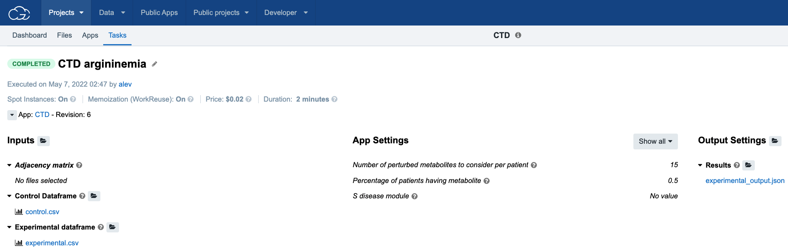

# Connect the dots
Connect the dots (CTD) is a graph-based algorithm used for finding the subset of highly connected nodes (F) of the selected set of nodes (S) inside a graph G. Its application is specially adapted for metabolomics, concretely for finding the highly connected subset of perturbed metabolites that can be used as the potential disease markers.
Our novel network-based approach, CTD, “connects the dots” between metabolite perturbations observed in individual metabolomics profiles and a given disease state by calculating how connected those metabolites are in the context of a disease-specific network. It consists of several stages:
- Background knowledge graph generation
- The encoding algorithm: includes generating node permutations using a network walker, converting node permutations into bitstrings, and calculating the minimum encoding length between k codewords
- Calculate the probability of a node subset based on the encoding length
- Calculate similarity between two node subsets, using a metric based on mutual information.

## Usage
CTD can receive as input experimental (disease) and control datasets with z-scores of metabolite perturbations. It will automatically predict metabolite relation graph (using Graphical LASSO algorithm) and disease module (S) containing set of ```kmx``` most perturbed metabolites. Then, the subset of most connected perturbed metabolites will be calculated and written to output JSON file together with its p-value.
Another option is to provide a weighted graph (adjacency matrix) and a list of nodes of interest.

## How to install
CTD can be run locally, inside Docker container or as a public tool on [Cancer Genomics Cloud](https://cgc.sbgenomics.com/) platform.
### Running locally
 Install on R 4.2 and the following dependencies: ```huge, MASS, rjson, stringr, fs, igraph, argparser, CTD```
 Clone the repository: ```git clone https://github.com/BRL-BCM/CTD.git ```
```
# Rscript R/CTD.r --help
Connect The Dots - Find the most connected sub-graph

flags:
  -h, --help             show this help message and exit

optional arguments:
  -x, --opts             RDS file containing argument values
  -e, --experimental     Experimental dataset file name [default: ]
  -c, --control          Control dataset file name [default: ]
  -a, --adj_matrix       CSV with adjacency matrix [default: ]
  -d, --disease_module   Comma-separated list of graph G nodes to
                         consider when searching for the most connected
                         sub-graph
  -k, --kmx              Number of highly perturbed nodes to consider.
                         Ignored if disease_module is given. [default:
                         15]
  -p, --present_in_perc  Percentage of patients having metabolite.
                         Ignored if disease_module is given. [default:
                         0.5]
  -o, --output_name      Name of the output JSON file.
  --out_graph_name       Name of the output graph adjacency matrix CSV
                         file created by GLASSO.
```
### Running inside docker
Download and install [Docker Desktop](https://www.docker.com/get-started).
If experimental and control datasets are available in the current directory (e. g. from ```data/example_argininemia```) run:
```sh
docker run -it -v $(PWD):/mnt vladimirkovacevic/ctd:1.9 Rscript /opt/CTD/R/CTD.r --experimental /mnt/experimental.csv --control /mnt/control.csv --output_name /mnt/output.json
```
### Running on the cloud Cancer Genomics Cloud platform
CTD is available in the public apps galery on Cancer Genomics Cloud platform. After pulling it to the project all of its parameters and input files are possible to set and its execution can be easily started on the cloud instance.


## Examples

Run example with a small graph and provided disease module:
```sh
Rscript R/CTD.r --adj_matrix data/example_2/adj.csv --disease_module "S2,S4,S5,S7"
```
Run example with experimental arginenimia metabolite z-scores extracted from Miller 2015 data using [prepare_data.R script](data/example_argininemia/prepare_data.R):
```sh
Rscript R/CTD.r --experimental data/example_argininemia/experimental.csv --control data/example_argininemia/control.csv --kmx 15
```
All stages of the analysis pipeline with examples are available in ```vignette/CTD_Lab-Exercise.Rmd```

## License
MIT License
Copyright (c) 2021 BCM, Houston, Texas

## Using CTD in Google Colab.
### Click through the Google Colab Notebook, even before installing CTD.
Open /Colab_CTD_PLOSCB.ipynb in Google Colab to reproduce some results from Thistlethwaite et al. (2020) step by step. This does not require CTD local installation. You will:

1. Visualize individual or average cohort metabolomics profiles on comprehensive or individual pathway maps from MetaboLync, curated by Metabolon.
2. Estimate the probability and significance of a metabolite set against different disease-specific network contexts using CTD.
3. Use CTD as feature selection method and a covariate in Partial Least Square (PLS) regression.

## References
[1] Thistlethwaite L.R., Petrosyan V., Li X., Miller M.J., Elsea S.H., Milosavljevic A, [CTD](https://doi.org/10.1371/journal.pcbi.1008550): an information-theoretic method to interpret multivariate perturbations in the context of graphical models with applications in metabolomics and transcriptomics. Plos Comput Biol, 2021.

[2] Lillian R. Thistlethwaite1, Xiqi Li, Lindsay C. Burrage, Kevin Riehle, Joseph G. Hacia, Nancy Braverman, Michael F. Wangler, Marcus J. Miller, Sarah H. Elsea & Aleksandar Milosavljevic, Clinical diagnosis of metabolic disorders using untargeted metabolomic profiling and disease‑specific networks learned from profiling data, scientific reports, 2022.
