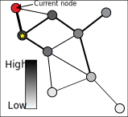

  
```{r setup, include=FALSE}
knitr::opts_chunk$set(echo = TRUE, fig.align="center")
require(CTD)
require(huge)
```
This document was rendered at `r Sys.time()`

# I. Generate background knowledge graph.

## I.I: Manually build graphs from adjacency matrices.
{width=350px}

```{r manually_build_graph}
adj_mat = rbind(c(0,3,1,0,0,0,0,0,0), #A's neighbors
                c(3,0,2,2,0,0,0,0,0), #B's neighbors
                c(1,2,0,0,2,0,0,0,0), #C's neighbors
                c(0,2,0,0,1,0,1,1,0), #D's neighbors
                c(0,0,2,1,0,2,0,2,0), #E's neighbors
                c(0,0,0,0,2,0,0,0,0), #F's neighbors
                c(0,0,0,1,0,0,0,1,0), #G's neighbors
                c(0,0,0,1,2,0,1,0,1), #H's neighbors
                c(0,0,0,0,0,0,0,1,0) #I's neighbors
                )
rownames(adj_mat) = c("A", "B", "C", "D", "E", "F", "G", "H", "I")
colnames(adj_mat) = c("A", "B", "C", "D", "E", "F", "G", "H", "I")
# Convert adjacency matrices to igrpah objects for all three graphs.
ig = graph.adjacency(adj_mat, mode="undirected", weighted=TRUE, add.colnames = "name")
print(ig)

```


## I.II: Learn a graph from data.
Note all code chunks in sections I - IV may rely on lines in previous code chunks, so do not empty your environment between code chunks.
```{r learn_graph, eval=FALSE}
# Load the Miller2015_Heparin dataset
data(Miller2015)
# Only include metabolites that are present in >90% reference samples.
fil.rate = Miller2015$`Times identifed in all 200 samples`/200
names(fil.rate) = rownames(Miller2015)
data_mx = Miller2015[,grep("IEM_", colnames(Miller2015))]
data_mx = data_mx[which(fil.rate>0.90), ]
dim(data_mx)
# Remove any metabolites where any profile has a z-score > 1000. These are likely imputed raw values that were not z-scored.
rmMets = names(which(apply(data_mx, 1, function(i) any(i>20))))
if (length(rmMets)>0) {
  data_mx = data_mx[-which(rownames(data_mx) %in% rmMets),]
}
dim(data_mx)

# Get data from all patients with Argininemia
arg_data = data_mx[,which(diagnoses$diagnosis=="Argininemia")]
# Add surrogate disease and surrogate reference profiles based on 1 standard deviation 
# around profiles from real patients to improve rank of matrix when learning Gaussian 
# Markov Random Field network on data. While surrogate profiles are not required, they tend 
# to learn less complex networks (i.e., networks with less edges) and in faster time.
arg_data = data.surrogateProfiles(arg_data, 1, FALSE, TRUE, ref_data = data_mx[,which(diagnoses$diagnosis=="No biochemical genetic diagnosis")])
dim(arg_data)

# Learn a Gaussian Markov Random Field model using the Graphical LASSO in the R package "huge". 
# Select the regularization parameter based on the "STARS" stability estimate.
require(huge)
#This will take 30 seconds - 1 minute.
arg = huge(t(arg_data), method="glasso")
plot(arg)
# This will take several minutes. For a faster option, you can use the "ebic" criterion instead of "stars", but we recommend "stars".
arg.select = huge.select(arg, criterion="stars")
plot(arg.select)
# This is the regularization parameter the STARS method selected.
print(arg.select$opt.lambda)
# This is the corresponding inverse of the covariance matrix that corresponds to the selected regularization level.
arg_icov = as.matrix(arg.select$opt.icov)
# Remove all "self" edges, as we are not interested in self-relationships.
diag(arg_icov) = 0
rownames(arg_icov) = rownames(arg_data)
colnames(arg_icov) = rownames(arg_data)
# Convert adjacency matrices to an igraph object.
ig_arg = graph.adjacency(arg_icov, mode="undirected", weighted=TRUE, add.colnames = "name")
print(ig_arg)
```


# II. The Probability Diffusion Algorithm
## II.I From a starting node.
Run the following code, then go to the directory, and open all diffusionEventMovie*.png files all at once. Starting from the first image, view how the probability diffusion algorithm works to diffuse 100% probability to the rest of the graph. Be sure to pay attention to the recursion level listed in the title of each image, to imagine where in the call stack the algorithm is at the captured time the image was generated.
```{r diffusion_no_visited}
# Set some global parameters for the Probability Diffusion Algorithm. 
p0=0.0
p1=1.0
thresholdDiff=0.01

G=vector(mode="list", length=length(V(ig)$name))
G[1:length(G)] = 0
names(G) = c("A", "B", "C", "D", "E", "F", "G", "H", "I")
startNode = "A"
visitedNodes = startNode
# Probability diffusion truncates at
thresholdDiff=0.01
coords = layout.fruchterman.reingold(ig)
V(ig)$x = coords[,1]
V(ig)$y = coords[,2]
# Global variable imgNum
imgNum=1
G_new = graph.diffuseP1Movie(p1, startNode, G, visitedNodes, ig, recursion_level=1, output_dir = sprintf("%s/images", getwd()))
# Inherited probabilities across all nodes should add to 1.
sum(unlist(G_new))
# Which node inherited the highest probability from startNode?
G_new[which.max(G_new)]
```

## II.II From a starting node, after visiting previous nodes.
Now, delete all diffusionEventMovie*.png files from your current directory, and run the following code. View the new image stack in the same way we did previously.
```{r diffusion_with_visited}
# Now let's see how the probability diffusion algorithm diffuses probability after B has been "stepped" into.
visitedNodes = c("A", "B")
startNode = "B"
imgNum=1

G_new = graph.diffuseP1Movie(p1, startNode, G, visitedNodes, ig, 1, output_dir = sprintf("%s/images", getwd()))
# Inherited probabilities across all nodes should add to 1.
sum(unlist(G_new))
# Which node inherited the highest probability from startNode?
G_new[which.max(G_new)]
```

## II.III Diffusing through visited nodes, based on connectivity.
Sometimes the startNode is "stranded" by a bunch of visited nodes. The diffusion algorithm diffuses "through" visited nodes, so that nodes in the same connected component can be prioritized over nodes in a different connected component, or "island nodes" (e.g. in the below code snippet, "I" is an island node). This only works currently for nodes 2 hops away from the current startNode, however.
```{r diffuse_through_visited}
adj_mat = rbind(c(0,1,2,0,0,0,0,0,0), #A's neighbors
                c(1,0,3,0,0,0,0,0,0), #B's neighbors
                c(2,3,0,0,1,0,0,0,0), #C's neighbors
                c(0,0,0,0,0,0,1,1,0), #D's neighbors
                c(0,0,1,0,0,1,0,0,0), #E's neighbors
                c(0,0,0,0,1,0,0,0,0), #F's neighbors
                c(0,0,0,1,0,0,0,1,0), #G's neighbors
                c(0,0,0,1,0,0,1,0,0), #H's neighbors
                c(0,0,0,0,0,0,0,0,0) #I's neighbors
                )
rownames(adj_mat) = c("A", "B", "C", "D", "E", "F", "G", "H", "I")
colnames(adj_mat) = c("A", "B", "C", "D", "E", "F", "G", "H", "I")
# Convert adjacency matrices to igrpah objects for all three graphs.
ig = graph.adjacency(adj_mat, mode="undirected", weighted=TRUE, add.colnames = "name")
print(ig)
adjacency_matrix = list(adj_mat)

# Now let's see how the probability diffusion algorithm diffuses probability after B has been "stepped" into "C" and then "A". As you can see, startNode "A" is surrounded by visited nodes "B" and "C". It needs to be smart enough to weigh "E" and "F" before "D", "H", "G" and "I".
visitedNodes = c("B", "C", "A")
startNode = "A"
G_new = graph.diffuseP1(1.0, startNode, G, visitedNodes, 1, verbose=TRUE)
# Inherited probabilities across all nodes should add to 1.
sum(unlist(G_new))
# Which node inherited the highest probability from startNode?
G_new[which.max(G_new)]
```


# III. The Network Encoding Algorithms
## III.I Multi-Node Diffusion Encoding
```{r adaptive_network_walker}
adj_mat = rbind(c(0,3,1,0,0,0,0,0,0), #A's neighbors
                c(3,0,2,2,0,0,0,0,0), #B's neighbors
                c(1,2,0,0,2,0,0,0,0), #C's neighbors
                c(0,2,0,0,1,0,1,1,0), #D's neighbors
                c(0,0,2,1,0,2,0,2,0), #E's neighbors
                c(0,0,0,0,2,0,0,0,0), #F's neighbors
                c(0,0,0,1,0,0,0,1,0), #G's neighbors
                c(0,0,0,1,2,0,1,0,1), #H's neighbors
                c(0,0,0,0,0,0,0,1,0) #I's neighbors
                )
rownames(adj_mat) = c("A", "B", "C", "D", "E", "F", "G", "H", "I")
colnames(adj_mat) = c("A", "B", "C", "D", "E", "F", "G", "H", "I")
# Convert adjacency matrices to igrpah objects for all three graphs.
ig = graph.adjacency(adj_mat, mode="undirected", weighted=TRUE, add.colnames = "name")
print(ig)
adjacency_matrix = list(adj_mat)

# Generate PNGs to animate the multi-node encoding node ranks.
ranks = multiNode.getNodeRanksMovie(subset.nodes = c("A", "B"), ig, output_filepath = sprintf("%s/images", getwd()), movie=TRUE, zoomIn = FALSE)

# Get node ranks as list object, with no images generated
ranks = multiNode.getNodeRanks(S = c("A", "B"), G)
```

## III.II Single-Node Diffusion Encoding
```{r unbiased_network_walker}
# This network walker is less sensitive, but node permutations can be calculated ahead of time (along the lines of a dynamic programming solution), so thousands of subsets can be reasoned about very quickly.

# Generate PNGs to animate the single-node encoding node ranks.
ranks = singleNode.getNodeRanksMovie(subset.nodes = c("A", "B"), ig, output_filepath = sprintf("%s/images", getwd()), num.misses = log2(length(G)), zoomIn = FALSE)

# Get node ranks as list object, with no images generated
S = c("A", "B")
ranks = list()
for (n in 1:length(S)) {
  ind = which(names(G)==S[n])
  ranks[[n]] = singleNode.getNodeRanksN(ind, G, S, num.misses = log2(length(G)))
}
names(ranks) = S
```


# IV. The Encoding Process
We're going to go back to our data using the Arginase deficiency network model, and the Miller et al (2015) dataset.
## IV.I Choose your node subset.
```{r node_subset}
# Maximum subset size to inspect
kmx=15
# Some global variables from before.
adjacency_matrix = list(arg_icov)
G=vector(mode="list", length=length(V(ig_arg)$name))
G[1:length(G)] = 0
names(G) = V(ig_arg)$name

# Get our node subset associated with the $KMX highest perturbed (up or down) in our first Arginase deficiency sample.
S_arg = sort(abs(arg_data[,1]), decreasing=TRUE)[1:kmx]
print(S_arg)
```

## IV.II Get k node permutations.
```{r node_permutations}
# Get the multi-node encoding node ranks starting from each node in the subset S_arg.
ranks = multiNode.getNodeRanks(S = names(S_arg), G, verbose=TRUE)
```

## IV.III Convert to bitstrings.
```{r convert_to_bitstrings}
# Get the bitstrings associated with the patient's perturbed metabolites in "S_arg" based 
# on the node ranks calculated in the previous step, "ranks".
ptBSbyK = multiNode.getPtBSbyK(names(S_arg), ranks)
```

## IV.IV Get encoding length of minimum length codeword.
```{r encoding_length}
ptID = colnames(arg_data)[1]
data_mx.pvals=apply(arg_data[,which(colnames(arg_data) %in% diagnoses$id)], c(1,2), function(i) 2*pnorm(abs(i), lower.tail=FALSE))
res = mle.getEncodingLength(ptBSbyK, t(data_mx.pvals), ptID, G)
ind.mx = which.max(res$d.score)
res[ind.mx,]
```

## IV.V Get probability of node subset.
```{r probability_of_set}
# This is the lower bound of the probability associated with the metabolites in S_arg. 
# The higher the probability relative to a random set of the same size, the more 
# tightly connected the metabolite set is.
2^-res[ind.mx,"IS.alt"]
# Note the probability printed above may seem low, but there are log2(length(G), kmx) outcomes that probability is assigned between. We should expect a probability for a node set of size kmx in a length(G) network to have probability:
2^-(log2(choose(length(G), kmx)))
# You'll notice the probability associated with the metabolite set we encoded, S_arg, is orders of magnitude higher than a uniform probability model. This implies the metabolites in S_arg are  connected in the network ig_arg more than is expected by chance.
```

## IV.V Get p-value of variable length encoding vs. fixed length encoding.
```{r pvalue_of_set}
# You can interpret the probability assigned to this metabolite set by comparing it to a null encoding algorithm, which 
# uses fixed codes for all metabolites in the set. The "d.score" is the difference in bitlength between the null and alternative
# encoding models. Using the Algorithmic Significance theorem, we can estimate the upper bounds on a p-value by 2^-d.score.
2^-res[ind.mx,"d.score"]

# All metabolites in S_arg 
names(S_arg)
# Which metabolites were a part of the 11 metabolite subset of patient IEM_1006's top 15 perturbed metabolites that had the above p-value?
ptBSbyK[[ind.mx]] # all metabolites in the bitstring
names(which(ptBSbyK[[ind.mx]]==1)) # just the F metabolites that are in S_arg that were were "found"
```


# V. Patient Similarity, Single-Node Encoding Recommended
```{r patient_similarity, eval=FALSE}
data_mx = arg_data[,which(colnames(arg_data) %in% diagnoses$id)]
data_mx = data_mx[,1:8]
for (pt in 1:ncol(data_mx)) {
  ptID=colnames(data_mx)[pt]
  S_arg = c(S_arg, names(sort(abs(data_mx[,pt]), decreasing=TRUE)[1:kmx]))
}
S_arg = unique(S_arg)
# Pre-computing node ranks from all perturbed metabolites across all patients is the overhead we have to pay for when using this mutual information-based similarity metric, but will pay off when we go to compute several pairwise calculations of similarity.
# It feels like a lot of overhead when run serially, but when run in parallel (recommended) (e.g., a computing cluster) this finishes in minutes. 
ranks = list()
for (n in 1:length(S_arg)) {
  print(sprintf("Calculating node ranks for perturbed metabolite %d/%d across %d patients.", n, length(S_arg), ncol(data_mx)))
  ind = which(names(G)==S_arg[n])
  ranks[[n]] = singleNode.getNodeRanksN(ind, G, S_arg)
}
names(ranks) = S_arg
# Calculate patient bitstrings
ptBSbyK = list()
for (pt in 1:ncol(data_mx)) {
  ptID=colnames(data_mx)[pt]
  S_pt = names(sort(abs(data_mx[,pt]), decreasing=TRUE)[1:kmx])
  ptBSbyK[[ptID]] = singleNode.getPtBSbyK(S_pt, ranks)
}
# Now perform mutual information-based patient similarity scoring
res = list()
t = list(ncd=matrix(NA, nrow=ncol(data_mx), ncol=ncol(data_mx)),
        jac=matrix(NA, nrow=ncol(data_mx), ncol=ncol(data_mx)))
rownames(t$ncd) = colnames(data_mx)
colnames(t$ncd) = colnames(data_mx)
rownames(t$jac) = colnames(data_mx)
colnames(t$jac) = colnames(data_mx)
for (i in 1:kmx) { res[[i]] = t }
for (pt in 1:ncol(data_mx)) {
  print(sprintf("Patient %d vs...", pt))
  ptID=colnames(data_mx)[pt]
  for (pt2 in pt:ncol(data_mx)) {
    print(sprintf("Patient %d.", pt2))
    ptID2=colnames(data_mx)[pt2]
    # Because we pre-computed node ranks for all perturbed metabolites across our 8 patients, this will complete very quickly.
    tmp = mle.getPtSim(ptBSbyK[[ptID]], ptID, ptBSbyK[[ptID2]], ptID2, data_mx, ranks)
    for (k in 1:kmx) {
      res[[k]]$ncd[ptID, ptID2] = tmp$NCD[k]
      res[[k]]$jac[ptID, ptID2] = tmp$dirSim[k]
      res[[k]]$ncd[ptID2, ptID] = tmp$NCD[k]
      res[[k]]$jac[ptID2, ptID] = tmp$dirSim[k]
    }
  }
}
res_all = res

```


# VI. Visualizations
```{r visualizations}
# Multi-dimensional scaling
# if you have diagnostic labels associated with the colnames(data_mx), send them using diagnoses parameter
res_ncd = lapply(res_all, function(i) i$ncd)
res_jac = lapply(res_all, function(i) i$jac)
ncd = mle.getMinPtDistance(res_ncd)
jacdir = mle.getMinPtDistance(res_jac)
diags = colnames(data_mx)
diags[which(diags %in% diagnoses$id[which(diagnoses$diagnosis=="Argininemia")])] = "ARG"
diags[which(diags %in% diagnoses$id[which(diagnoses$diagnosis!="Argininemia")])] = "negCntl"
names(diags) = colnames(res_all[[1]]$ncd)
# alpha weighs infromation from NCD with information from Jaccard-dir. alpha must be between 0 and 1.
p =  htmltools::tagList()
i = 1
for (alpha in seq(0, 1, 0.1)) {  
  patientSim=alpha*ncd+(1-alpha)*jacdir
  colnames(patientSim) = colnames(res_all[[1]]$ncd)
  rownames(patientSim) = colnames(res_all[[1]]$ncd)
  p[[i]] = as_widget(plot.mdsSim(patientSim, diags, k=2, NULL))
  i = i + 1
  
  # Hierarchical clustering
  # A PNG image called "ptSimilarity.png" will save in the path set as parameter "path" in plot.hmSim function call.
  plot.hmSim(patientSim, path=getwd(), diags)
  
  # K-NN
  plot.knnSim(patientSim, diags, diag="ARG")
}
p[[1]]
p[[2]]
p[[3]]
p[[4]]
p[[5]]
p[[6]]
p[[7]]
p[[8]]
p[[9]]
p[[10]]
p[[11]]

```
